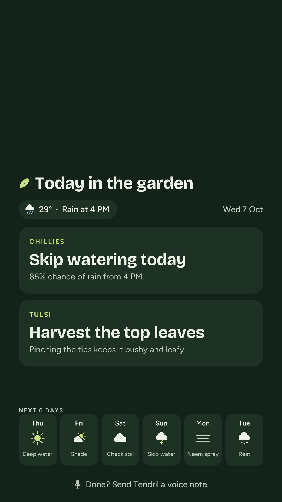
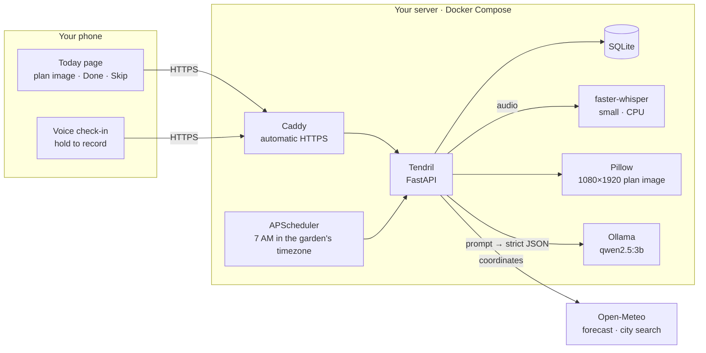

# Tendril

**A garden assistant you never open.**

Tendril reads the weather forecast for your garden, plans a few small care tasks for each day with a local open-weight model, and puts the day's plan on your phone every morning. When you've done something, tap **Done**, or hold the mic and say so. Tendril listens, ticks the task off, and adjusts the plan.

Everything runs on your own server. All AI is open-weight. There are no paid APIs.

<p align="center"></p>

## Designed to be ignored

Most garden apps want your attention. Tendril wants the opposite.

- **The plan comes to you.** Each morning at 7 the Today page holds the day's plan as one image, sized for a lock screen, with the top third left clear for the clock. Add the page to your home screen and glance at it while the kettle boils.
- **Two tasks, at most.** Every action is under six words. "Skip watering today." "Move pot into afternoon shade." If nothing needs doing, it says so.
- **It reacts to the sky, not to you.** Rain above 60% means no watering. Above 35°C means shade. Three dry days in a row means a deep soak. If the 7 AM forecast changes (rain arrives, rain disappears, a heat spike), only today's tasks are rewritten.
- **Talking is the interface.** "Watered the chillies, there are aphids on the tulsi" is enough. Tendril marks the watering done, and because pests are serious it re-plans the rest of the week with a treatment first.
- **One reminder, gently.** After 6 PM, if something is still pending, the page shows a single line: still time, or tap Skip, no pressure.

## Why open source

- **Your data stays home.** Your location, your voice notes and your garden's history live in a SQLite file on your server. Voice is transcribed on your own CPU. Nothing is uploaded to an AI provider.
- **No accounts, no subscriptions, no per-request bills.** The forecast and city search come from [Open-Meteo](https://open-meteo.com), which is free and needs no key. The only data that leaves your server is your garden's coordinates, sent to Open-Meteo for the forecast.
- **Swappable models.** The planner speaks to [Ollama](https://ollama.com), so any model it can run works. Set `OLLAMA_MODEL=llama3.2:3b` or a larger model if you have the RAM. Speech uses [faster-whisper](https://github.com/SYSTRAN/faster-whisper). Pick `tiny` for speed or `medium` for accuracy, and English, Hindi or auto-detect.
- **Readable and testable.** It's a small FastAPI app with one service per job and 150+ tests that mock the model, the weather and the microphone.

## How it works



**Every morning at 7** (in the garden's own timezone):

1. **Sunday:** fetch the 7-day forecast, plus the last 3 days for the dry-spell rule. Send the plants, the forecast and two weeks of check-in facts to the model, and ask for `{"days": [{"date", "tasks": [{"plant", "action", "reason"}]}]}`.
2. **Other days:** re-fetch today's forecast. If it changed meaningfully, ask the model to rewrite only today's tasks.
3. Render today's image, ready for the Today page.

**The model proposes, the rules decide.** Every reply is validated with Pydantic:
- at most 2 tasks a day
- actions under 6 words
- only real plant names
- every date present

A bad reply gets one retry that tells the model exactly what was wrong. If that fails too, a rule-based planner takes over. Either way, the weather rules are applied last, so they always hold:
- skip watering when rain is likely
- shade on hot days
- deep watering after a dry spell
- treat reported pests, wilting or rot first

They also catch the habits of small models: copied instructions, a task repeated all week, watering a plant you already water by hand.

**A voice note** goes through faster-whisper (your plant names are passed as a spelling hint). Then the model extracts `{"plant", "done", "observations", "health_flags"}`. Matching tasks are ticked off, the facts feed future plans, and wilting, pests or rot trigger a re-plan of the rest of the week in the background. The Today page then says the plan changed.

```
app/
  main.py            app factory, startup (database, scheduler, whisper preload)
  routers/           setup · today · tasks (Done/Skip) · checkin (voice + typed)
  services/
    weather.py       Open-Meteo forecast, geocoding, change detection
    planner.py       prompts, validation, retry, model ↔ rules glue
    rules.py         weather rules and the rule-based fallback planner
    plans.py         weekly plan, daily refresh, re-plan; storage
    render.py        the 1080×1920 plan image (icons drawn in code)
    speech.py        faster-whisper wrapper
    checkin.py       fact extraction, task matching, serious-issue detection
    today.py         what the Today page shows; image caching
  scheduler.py       the 7 AM job
scripts/             seed.py (2 demo plants) · demo.py
tests/               pytest, with the model, weather and whisper mocked
```

## Run it

You need Docker with Compose. The first start downloads the Ollama image, `qwen2.5:3b` (1.9 GB) and the whisper `small` model (486 MB). Plan for about 4 GB of free RAM.

```bash
git clone https://github.com/pyarchana/tendril.git
cd tendril
cp .env.example .env        # optional for a local try; defaults work
docker compose up -d --build
docker compose logs -f ollama-pull   # wait for "success"
```

Open <http://localhost:8000/setup>, search your city, add your plants, and press **Plan this week now**.

To see the whole loop without setting anything up:

```bash
make demo
```

This seeds a demo garden with two plants, plans the week with the local model and renders today's image. It prints the Today page link. On Windows without `make`, run `docker compose exec app python -m scripts.demo`.

A few more:

```bash
make note TEXT="Watered the chillies, aphids on the tulsi"   # a typed check-in
docker compose exec app python -m scripts.demo --voice /tmp/note.wav   # a recorded one
make logs
make down
```

A week plan from `qwen2.5:3b` takes 1–2 minutes on a laptop CPU, and a voice note about 25 seconds. Both run in the background, so the pages never wait on the model.

## Deploy on DigitalOcean with HTTPS

Voice recording in the browser needs HTTPS, and your phone needs a real address. Caddy handles both, with free certificates from Let's Encrypt.

1. **Create a Droplet:** Ubuntu 24.04, at least **8 GB RAM and 4 vCPUs**, because the model and whisper share memory and CPU speed sets the planning time. Add your SSH key.
2. **Point a domain at it:** add an `A` record, such as `garden.example.com`, pointing to the Droplet's IP.
3. **Install Docker and open the web ports:**

   ```bash
   ssh root@your-droplet-ip
   curl -fsSL https://get.docker.com | sh
   ufw allow OpenSSH && ufw allow 80 && ufw allow 443 && ufw --force enable
   ```

4. **Configure:**

   ```bash
   git clone https://github.com/pyarchana/tendril.git && cd tendril
   cp .env.example .env
   ```

   In `.env`, set:

   ```ini
   PUBLIC_BASE_URL=https://garden.example.com
   DOMAIN=garden.example.com
   SETUP_PASSWORD=pick-something-long
   ```

5. **Start with HTTPS:**

   ```bash
   docker compose --profile https up -d --build    # or: make https
   docker compose logs -f ollama-pull
   ```

6. **Set up your garden:** open `https://garden.example.com/setup`. The browser asks for the setup password, with any username. Then choose your city, add your plants and plan the week.

The app port stays bound to `127.0.0.1`, so the only way in from outside is through Caddy. Data lives in Docker volumes (`tendril-data`, `ollama-models`), so `git pull && docker compose --profile https up -d --build` upgrades without losing anything.

## Put it on your phone

Step 3 of the setup page shows a QR code for your private Today link.

1. **Scan it** with your phone's camera and open the link.
2. **Add it to your home screen:**
   - **Android (Chrome):** tap **⋮**, then **Add to Home screen**.
   - **iPhone (Safari):** tap **Share**, then **Add to Home Screen**.
3. **Each morning** it opens straight to the day's plan. Tap **Done** or **Skip**, or **Voice note** to talk.
4. **Optional:** **Save as wallpaper** downloads the day's image for your lock screen.

The link carries a random token. Anyone with it can see and update your garden, so keep it to yourself. The setup page itself is protected by `SETUP_PASSWORD`.

### Your lock screen, automatically (iPhone)

Every garden also has a lock-screen picture at `<your Today link>/lockscreen.png`. It's today's plan, padded to the 19.5:9 shape of modern phones so nothing gets cropped, and it's never cached, so the same link always returns the current plan. Step 4 of the setup page shows the link with a copy button. To set it automatically each morning:

1. Open the setup page on your iPhone and copy the lock-screen link.
2. In **Shortcuts**, go to **Automation**, tap **New Automation**, then **Time of Day**. Pick a few minutes after the morning job (7:05 by default), **Daily**, and **Run Immediately**.
3. Add **Get Contents of URL** and paste the link.
4. Add **Set Wallpaper Photo**, choose your lock screen, and turn off **Show Preview** and **Crop to Subject**.

Action names can differ a little between iOS versions. The iPhone must be able to reach Tendril when the automation runs, for example on the same Wi-Fi or through your server's HTTPS address. On Android, an automation app such as MacroDroid can do the same with a "set wallpaper from URL" action.

What's tested: the link itself, fetched over Wi-Fi the way a Shortcut does (full-size picture, never cached), and that the same link shows the new plan after a re-plan and on the next morning. What isn't, yet: the Shortcuts steps on a real iPhone. If they differ on your phone, please open an issue.

## Configuration

Everything is set in `.env` (see [`.env.example`](.env.example)):

| Setting | Default | What it does |
|---|---|---|
| `PUBLIC_BASE_URL` | `http://localhost:8000` | Address used in the phone link and QR code |
| `DOMAIN` | | Domain Caddy gets a certificate for |
| `SETUP_PASSWORD` | empty | Protects `/setup`; set it before going online |
| `OLLAMA_MODEL` | `qwen2.5:3b` | Any model Ollama can run |
| `OLLAMA_TIMEOUT` | `300` | Seconds per model call (CPU planning is slow) |
| `WHISPER_MODEL` | `small` | `tiny`, `base`, `small`, `medium`… |
| `WHISPER_LANGUAGE` | `auto` | `en`, `hi` or `auto` |
| `MORNING_HOUR` | `7` | When the daily job runs, in the garden's timezone |
| `SCHEDULER_ENABLED` | `true` | Turn the morning job off |
| `APP_BIND` | `127.0.0.1` | Use `0.0.0.0` to try it from a phone on your Wi-Fi (no voice without HTTPS) |
| `WEATHER_TIMEOUT` | `10` | Seconds per Open-Meteo call |

## Development

```bash
python -m venv .venv
.venv/bin/pip install -r requirements-dev.txt      # Windows: .venv\Scripts\pip
.venv/bin/python -m pytest -q
.venv/bin/python -m uvicorn app.main:app --reload  # needs Ollama on localhost:11434
```

The tests never touch the network or a real model. Open-Meteo is mocked with `respx`, the model with a scripted fake, and whisper with a fake transcriber. They cover planning (valid JSON, retry, fallback, every weather rule), forecast changes, image rendering, the Today page, voice check-ins, the setup page and the scheduler.

## What's next

- **Push to the lock screen.** Web Push, or ntfy as an option, so the morning plan arrives without opening anything.
- **Whole-garden tasks.** "Skip watering everything" as one task instead of naming a single plant, plus a "covered" flag for pots that rain doesn't reach.
- **A Hindi interface.** Voice notes already work in Hindi, but the pages are English-only.
- **Photos in check-ins.** A small open vision model could spot yellowing leaves or pests.
- **Season memory.** Learn which tasks you always skip and stop suggesting them.

## License

[MIT](LICENSE). The bundled fonts, [Bricolage Grotesque](https://github.com/ateliertriay/bricolage) and [Figtree](https://github.com/erikdkennedy/figtree), are under the SIL Open Font License; see `app/static/fonts/`.
